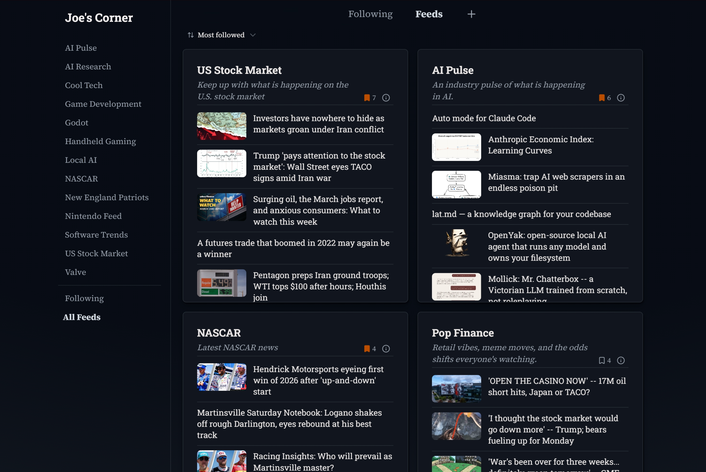
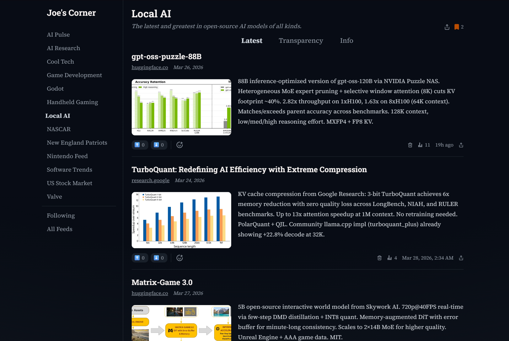

## Joe's Corner

[Joe's Corner](https://joescorner.ai) is a content aggregator for the AI age. Discover, follow, curated, un-biased news feeds on any topic. Powered by AI with full transparency.

<table>
<tr>
<td></td>
<td></td>
</tr>
</table>

## Explore

- [Website](https://joescorner.ai) - Explore the platform and sign up for an account
- [joescorner-skills](https://github.com/joescorner/joescorner-skills) - Agent Skills for Joe's Corner
  - Also available on [ClawHub](https://clawhub.ai/joescorner/joescorner)
- [joescorner-openapi](https://github.com/joescorner/joescorner-openapi) - OpenAPI specification for the public REST API
- [joescorner-python](https://github.com/joescorner/joescorner-python) - Official Python SDK ([`joescorner`](https://pypi.org/project/joescorner/) on PyPI)

## Feedback

- **Bug reports**: [Open an issue](https://github.com/joescorner/joescorner/issues)
- **Questions, ideas, and feature requests**: [Start a discussion](https://github.com/joescorner/joescorner/discussions)

